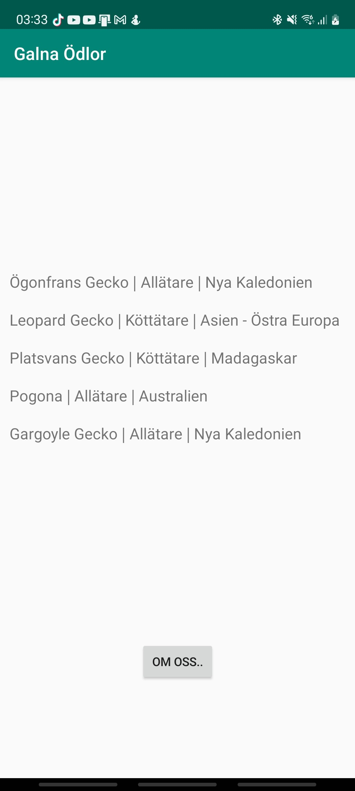
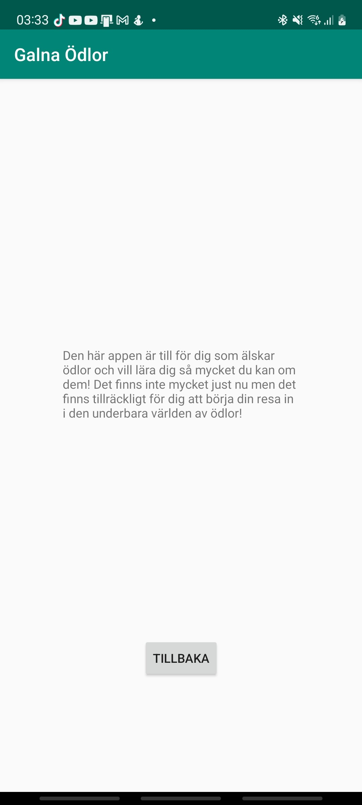

# Rapport
Denna app är gjord för Ödle älskare att kunna lära sig trivial fakta om sina favorit ödlor

## MainActivity
Det viktigaste i MainActivity är klassen mainAc2 och onPostExecute. 
- mainAc2 ser till att när knappen klickas sickas en intent till nästa activity.
- onPostExecute ser till att lägga in den översatta jsondatan till recyclerviewn så den kan användas och vissas upp

```java
    private void mainAc2(){
        Button click = (Button) findViewById(R.id.button);
        click.setOnClickListener(new View.OnClickListener() {
        @Override
        public void onClick(View view) {
                Intent intent = new Intent(MainActivity.this, SecondActivity.class);
                intent.putExtra("msg", "Hej på dig!");
                startActivity(intent);
                }
                });
    }
    
    public void onPostExecute(String json) {
        Type type = new TypeToken<ArrayList<Lizards>>() {}.getType();
        ArrayList<Lizards> listOfLizards = gson.fromJson(json, type);

        RecyclerView view = findViewById(R.id.recyclerView);
        recyclerviewadapter adapter = new recyclerviewadapter (this, listOfLizards);
        view.setAdapter(adapter);
        view.setLayoutManager(new LinearLayoutManager(this));
        adapter.notifyDataSetChanged();

    }
```

## SecondActivity
Har inte så mycket viktigt den har en intent som låter den gå till backa till MainActivity

```java
    private void mainAc(){
        Button click = (Button) findViewById(R.id.button2);
        click.setOnClickListener(new View.OnClickListener() {
            @Override
            public void onClick(View view) {
                Intent intent = new Intent(SecondActivity.this, MainActivity.class);
                intent.putExtra("msg", "Hej på dig!");
                startActivity(intent);
            }
        });
    }
```

## Huvudsidan

## Aboutsidan


